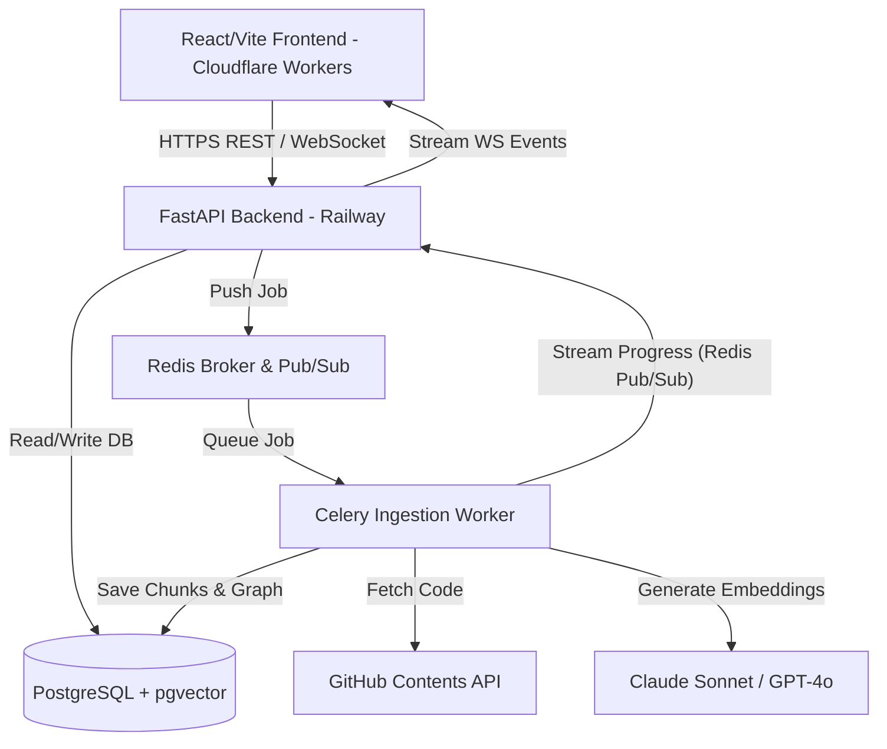
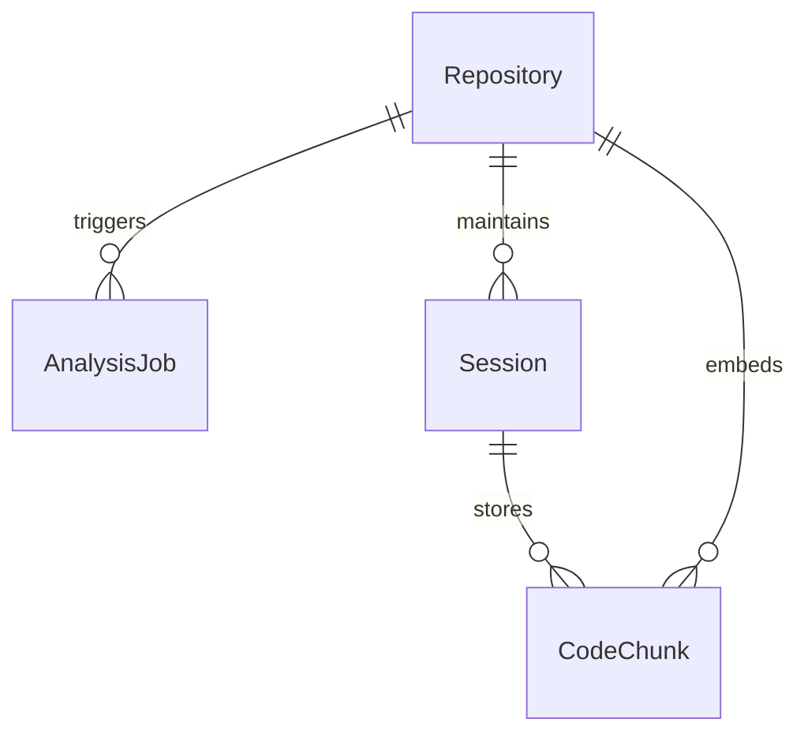
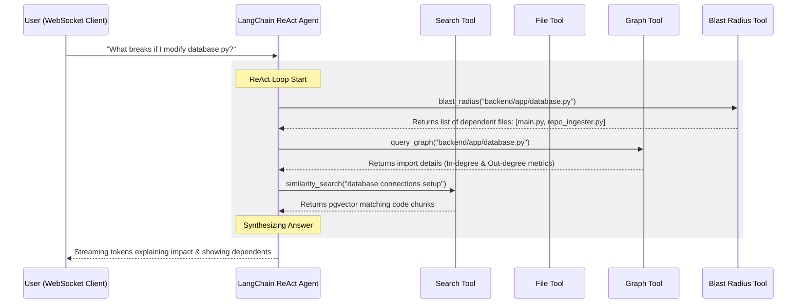

# DevLens AI — Complete Project Documentation

Welcome to the comprehensive technical documentation for **DevLens AI**. This document provides an in-depth architectural breakdown, code-level module explanation, data flow analysis, database schema mappings, and deployment details for the DevLens AI codebase.

---

## 1. System Overview

DevLens AI is a full-stack, production-ready SaaS application that acts as an intelligent cognitive layer for software codebases. Users provide a GitHub repository URL (public or private via secure OAuth tunnels) and immediately obtain:
1. **Interactive 2D Architecture Map:** Visualizes files as nodes and import dependencies as directed edges, using force-directed layout models.
2. **Blast Radius Analysis:** Enables developers to perform change impact analysis (answering "what breaks if I change this file?") via a BFS traversal of the reverse dependency graph.
3. **Smart Code Q&A:** A streaming conversational AI assistant powered by Claude (via LangChain ReAct agents) using **pgvector RAG** over semantically chunked code.
4. **Auto-Generated Onboarding Walkthroughs:** Automatic creation of high-fidelity, senior-engineer onboarding guides tracing entry points, startup procedures, database access, and architectural conventions.
5. **Interactive Execution Traces:** Visualized sequence diagrams showing code control flows across modules.

---

## 2. Core Architecture & Technology Stack

The project splits into a decoupled **FastAPI backend** (Python) and a **React/Vite/TypeScript frontend** (TanStack Start TS) communicating via synchronous REST APIs and real-time WebSockets.



### Technology Layer Breakdown

| Layer | Technology | Role & Details |
| :--- | :--- | :--- |
| **Frontend** | React 19, TypeScript, Vite | User interface rendering, client state management, interactive canvas drawings. |
| **Routing** | TanStack Router / TanStack Start | Full-stack meta-framework route rendering and type-safe routing. |
| **Styling** | Vanilla CSS (with Tailwind CSS utilities) | Custom design system (`styles.css`) featuring custom CSS variables and rich dark animations. |
| **Backend** | FastAPI 0.115 (Python 3.11) | High-performance asynchronous REST and WebSocket API gateway. |
| **Task Queue** | Celery + Redis | Asynchronous, decoupled ingestion processor for large-scale repositories. |
| **Database** | PostgreSQL | Relational transactional database storing users, analysis metadata, and graphs. |
| **Vector Database**| `pgvector` Extension | Efficient semantic vector indexing (1536 dimensions) for code chunks. |
| **ORM** | SQLAlchemy 2.x (Async) + Alembic | Asynchronous database session handling and schema migration tracking. |
| **AI Agent** | LangChain ReAct Agent | Orchestrates multi-step code exploration using 4 specialized tools + OpenAI GPT-4o. |
| **Embeddings** | OpenAI `text-embedding-3-small` | Converts chunks of code to 1536-dimensional semantic vectors. |

---

## 3. Database Schema Design

The relational database is powered by PostgreSQL with the `pgvector` extension enabled via SQLAlchemy.



### Models (`backend/app/models/`)

#### 1. Repository (`app/models/repository.py`)
Stores the indexed repository details, structural properties, and generated metrics.
- `id`: UUID (Primary Key)
- `owner`: String (e.g., `facebook`)
- `name`: String (e.g., `react`)
- `description`: Text
- `stars`: Integer
- `default_branch`: String (e.g., `main`)
- `commit_sha`: String
- `languages`: JSONB (Breakdown of file count per detected language)
- `is_monorepo`: Boolean
- `graph_data`: JSONB (Stores JSON serialized node/edge representation)
- `status`: Enum (`RepoStatus`: `PENDING`, `PROCESSING`, `COMPLETED`, `FAILED`)

#### 2. CodeChunk (`app/models/code_chunk.py`)
Stores code fragments alongside high-dimensional vector embeddings for RAG retrieval.
- `id`: UUID (Primary Key)
- `repo_id`: UUID (Foreign Key referencing `Repository.id`)
- `file_path`: String (Full path inside the repository)
- `language`: String
- `content`: Text (The code block itself)
- `token_count`: Integer
- `chunk_type`: String (`function`, `class`, `module`, or `generic`)
- `symbol_name`: String (Optional function/class identifier)
- `start_line`: Integer (Optional)
- `end_line`: Integer (Optional)
- `embedding`: Vector(1536) (PostgreSQL `pgvector` database type mapped to a 1536-dim float array)

#### 3. Session (`app/models/session.py`)
Maintains conversation logs and historical Q&A runs for a specific user-repository pair.
- `id`: UUID (Primary Key)
- `repo_id`: UUID (Foreign Key)
- `chat_history`: JSONB (Array of historical JSON conversation bubbles)

---

## 4. The 5-Step Ingestion Pipeline

The ingestion pipeline handles repository processing. It executes inside a Celery background task (`app/tasks/repo_tasks.py`), and uses `RepoIngester` (`app/core/repo_ingester.py`) to notify the API gateway of progress via Redis Pub/Sub, which is streamed to the user's browser over a WebSocket connection.

### Step-by-Step Execution Sequence

```
[User submits URL]
        │
        ▼
┌────────────────────────────────────────┐
│ Step 0: Clone & Fetch Metadata         │ -> Call GitHub REST API for repo size and metadata
└────────────────────────────────────────┘
        │
        ▼
┌────────────────────────────────────────┐
│ Step 1: Parse File Tree                │ -> Retrieve full file structure & apply exclusion filters
└────────────────────────────────────────┘
        │
        ▼
┌────────────────────────────────────────┐
│ Step 2: Fetch File Contents (Async)    │ -> Parallel download of indexable files (semaphore limited)
└────────────────────────────────────────┘
        │
        ▼
┌────────────────────────────────────────┐
│ Step 3: AST-Aware Semantic Chunking    │ -> Parse code using AST (Python) or regex (JS/TS)
└────────────────────────────────────────┘
        │
        ▼
┌────────────────────────────────────────┐
│ Step 4: Generate Embeddings (pgvector) │ -> Vectorize chunks using OpenAI text-embedding-3-small
└────────────────────────────────────────┘
        │
        ▼
┌────────────────────────────────────────┐
│ Step 5: Build Dependency Graph         │ -> Construct imports map using NetworkX & calculate layouts
└────────────────────────────────────────┘
        │
        ▼
[Real-Time Progress WebSockets Broadcast Done]
```

#### Step 0: Clone & Fetch Metadata
- Calls the GitHub REST API to get repository stars, commit hashes, and disk size.
- Restricts processing to files within specified limits (e.g. `MAX_REPO_SIZE_MB = 100`).

#### Step 1: Parse File Tree
- Retrieves the full repository folder structure via the GitHub Git Trees API.
- Evaluates files using a filtering utility (`app/core/file_utils.py`) to bypass binary documents, build assets, node modules, locks, and configuration objects.
- Analyzes extension distributions to form a language breakdown.
- Automatically identifies monorepos (searching for `package.json` workspaces or Lerna configurations) and candidate entry points (e.g., `server.ts`, `main.py`, `index.tsx`).

#### Step 2: Concurrent Content Retrieval
- Downloads file contents asynchronously.
- Implements an `asyncio.Semaphore(20)` constraint to limit active requests to 20 concurrent connections, preventing rate limit blocks from GitHub.

#### Step 3: AST-Aware Chunking (`app/core/chunker.py`)
Splits source files into semantically coherent blocks:
- **Python:** Parses code using the native `ast` library. Extracts top-level functions (`ast.FunctionDef`) and classes (`ast.ClassDef`) as individual chunks, compiling remaining global statements/imports into a `module` chunk.
- **JavaScript & TypeScript:** Runs regular expressions to scan for functions (`export const foo = () => ...`) and class declarations (`class AuthManager ...`). Resolves opening/closing curly brace depths to partition the file cleanly.
- **Other Languages (Go, Rust, Markdown, etc.):** Falls back to a sliding window chunker with overlapping character boundaries (`MAX_CHUNK_TOKENS = 512`, `OVERLAP_TOKENS = 64`).

#### Step 4: Embedding generation & pgvector Storage
- Chunks are vectorized in batches using the OpenAI API.
- Generates 1536-dimensional embeddings and executes a SQL upsert into the `code_chunks` table, purging any existing indexes for the repository.

#### Step 5: Dependency Graph Generation (`app/core/graph_builder.py`)
- Analyzes imports across files using language-specific import patterns (e.g. resolving `from app.core.database import db` in Python or relative `import { button } from '../components/button'` in TS).
- Instantiates a NetworkX directed graph (`nx.DiGraph`).
- Computes Fruchterman-Reingold spring layouts to generate normalized coordinates (scale 5-95%) for front-end rendering on a 2D canvas.
- Assigns metric values to each node:
  - **Coupling Score:** The node's degree centrality normalized relative to the most connected file in the graph.
  - **Complexity Score:** Line count relative to the largest source file.
  - **Is Entry Point:** True if the node has an in-degree of 0 and an out-degree greater than 0.

---

## 5. AI Agent & Conversational Q&A Core

The AI Q&A system is powered by `DevLensAgent` (`app/agent/devlens_agent.py`), which constructs a LangChain ReAct agent combined with OpenAI's GPT-4o. It integrates four specialized tools to interact with the repository's index.



### The 4 Custom Tools

#### 1. Code Search Tool (`search_code`)
- Executes vector similarity searches against code chunks.
- Performs cosine similarity checks over `pgvector` columns to return the top 6 matching code fragments alongside file paths and line ranges.

#### 2. File Reader Tool (`read_file`)
- Fetches all matching code chunks linked to a target file path.
- Assembles code fragments in line order to return a cohesive view of the file contents (capped at 3,000 characters).

#### 3. Dependency Graph Query Tool (`query_graph`)
- Queries the cached NetworkX graph structure.
- Resolves all directed dependencies (what this file imports) and dependents (what files import this file).

#### 4. Blast Radius Tool (`blast_radius`)
- Traverses the NetworkX directed graph in reverse.
- Executes a Breadth-First Search (BFS) starting at the target node up to a maximum depth of 3 levels to compile a list of downstream files impacted by a modification.

### Onboarding Documentation Generation
- Triggers five sequential similarity searches covering startup loops, core architecture, database models, route handling, and authentication systems.
- Combines the top 15 retrieved code fragments as context.
- Prompts GPT-4o to write a structured markdown guide detailing onboarding instructions, project conventions, and recommendations for a developer's first pull request.

---

## 6. Frontend Architecture & WebSocket Handlers

The user interface is built on React 19, Vite, and TanStack Start, styled with custom variables (`src/styles.css`).

### Key UI Features & Components

```
┌────────────────────────────────────────────────────────────────────────┐
│                          DEVLENS AI - TOP BAR                          │
│ Repo: facebook/react  |  TS: 62%  JS: 31%  |  Share  Export  Invite  ✕ │
├───────────────────────┬───────────────────────────────┬────────────────┤
│ FILTER FILES          │  [ARCH]  [FLOW]  [ONBOARDING] │ ASK DEVLENS    │
│ ┌───────────────────┐ │ ┌───────────────────────────┐ │ ┌────────────┐ │
│ │ ⌕ search...       │ │ │                           │ │ │ AI: Hello! │ │
│ └───────────────────┘ │ │       NetworkX Graph      │ │ │ Ask me key │ │
│ [FILES] [MOD] [ENTRY] │ │          Render           │ │ │ questions. │ │
│ 📄 Button.tsx         │ │                           │ │ └────────────┘ │
│ 📄 Modal.tsx          │ │                           │ │ ┌────────────┐ │
│ 📄 Sidebar.tsx        │ │                           │ │ │ Message... │ │
│                       │ └───────────────────────────┘ │ └────────────┘ │
└───────────────────────┴───────────────────────────────┴────────────────┘
```

#### 1. Ingestion WebSocket Handlers (`src/hooks/useAnalysis.ts`)
- Submits the repository URL to the API gateway and receives a `job_id` and `session_id`.
- Connects to `/ws/jobs/{job_id}` to receive real-time updates as the ingestion worker runs, mapping them to the UI progress bar.
- On completion, fetches the compiled graph and file tree details to render the dashboard.

#### 2. Chat WebSocket Handlers (`src/hooks/useChat.ts`)
- Connects to `/ws/chat/{session_id}` for Q&A interaction.
- Sends questions and appends incoming tokens to the assistant's message in real time, with a REST API fallback if the WebSocket disconnects.

#### 3. Interactive 2D Architecture Map
- Renders nodes and edges on a 2D canvas using the coordinates calculated in Step 5 of the backend ingestion pipeline.
- Integrates zoom, pan, hover tooltips, and click-to-focus triggers.
- Provides one-click exports to Mermaid and PlantUML formats.

#### 4. Interactive Execution Trace (Code Flow Diagram)
- Renders sequence diagrams representing request control flows.
- Visualizes communication sequences between components (e.g. from the client request to API gateways, database updates, and responses).

#### 5. GitHub OAuth Secure Tunnel (`src/routes/index.tsx`)
- Coordinates connection flows using animated character states (`handshaking`, `establishing`, `established`, `unwinding`).
- Provides secure index access to private repositories by managing temporary authentication states without storing API credentials on disk.

---

## 7. Configuration & Environment Settings

Global settings are managed using Pydantic Settings (`backend/app/config.py`). Below are the primary environment variables required to run the application:

| Environment Variable | Required | Description / Purpose |
| :--- | :--- | :--- |
| `DATABASE_URL` | Yes | PostgreSQL connection string (`postgresql+asyncpg://...`) |
| `REDIS_URL` | Yes | Redis host URL (`redis://localhost:6379/0`) |
| `OPENAI_API_KEY` | Yes | API key for generating embedding vectors and Q&A chat runs. |
| `ANTHROPIC_API_KEY` | No | Claude integration API key (optional depending on selected LLM). |
| `GITHUB_CLIENT_ID` | Yes | GitHub OAuth app Client ID for private repo access. |
| `GITHUB_CLIENT_SECRET`| Yes | GitHub OAuth app Client Secret. |
| `SECRET_KEY` | Yes | Session signing secret key. |
| `MAX_REPO_SIZE_MB` | No | Maximum repository size threshold (Default: `100`). |
| `MAX_FILES_PER_REPO` | No | Maximum repository file count constraint (Default: `1000`). |

---

## 8. Deployment Architecture

The application is configured for continuous delivery via GitHub Actions (`.github/workflows/deploy.yml`):

### Production Components
- **Backend (FastAPI, Redis, PostgreSQL, Celery):** Hosted on **Railway** with scaling groups.
- **Frontend:** Compiled to static files and deployed to **Cloudflare Workers** using Wrangler.
- **Database Migrations:** Managed using Alembic. Runs `alembic upgrade head` before each deployment step.

---

## 9. Developer Local Startup Guide

Follow these steps to spin up the full development stack locally:

### 1. Configure the Environment
```bash
# Clone the repository
git clone https://github.com/KaranParmar19/DEVLENS.ai.git
cd DEVLENS.ai

# Set up backend environment variables
cp backend/.env.example backend/.env
# Update backend/.env with your API keys (OpenAI, GitHub Client/Secret, Database connection)
```

### 2. Start Services via Docker Compose
Ensure Docker is running, then spin up database, redis, celery, and pgadmin services:
```bash
docker-compose up --build
```

### 3. Run Database Migrations
Execute Alembic migrations to construct the database schema and initialize the `pgvector` extension:
```bash
docker-compose exec api alembic upgrade head
```

### 4. Start the Frontend Dev Server
In a new terminal, install frontend dependencies and start the Vite development server:
```bash
# Install dependencies using Bun or NPM
npm install

# Start Vite server
npm run dev
```

### 5. Running Tests
Run tests inside the backend directory to verify API endpoints:
```bash
cd backend
pip install -r requirements.txt
pytest tests/ -v
```
