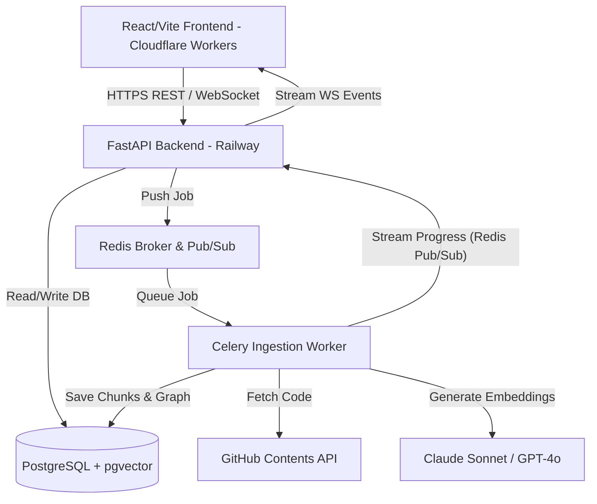
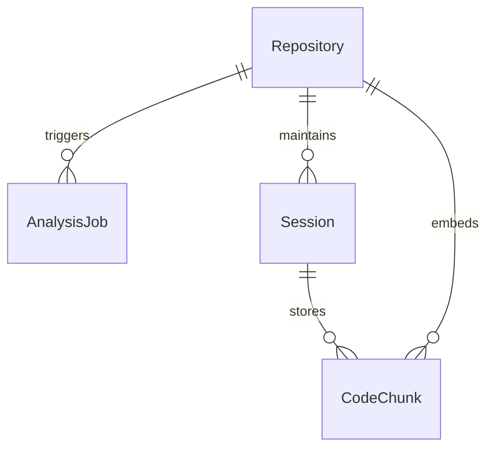
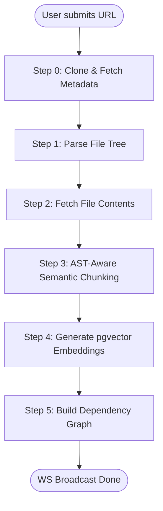

<div align="center">
  <h1>🌌 DevLens AI</h1>
  <p><strong>Complete Project Documentation</strong></p>
</div>

Welcome to the comprehensive technical documentation for **DevLens AI**. This document provides an in-depth architectural breakdown, code-level module explanation, data flow analysis, database schema mappings, and deployment details for the DevLens AI codebase.

---

## 1. System Overview

DevLens AI is a full-stack, production-ready SaaS application that acts as an intelligent cognitive layer for software codebases. Users provide a GitHub repository URL (public or private via secure OAuth tunnels) and immediately obtain:

1. **Interactive 2D Architecture Map:** Visualizes files as nodes and import dependencies as directed edges, using force-directed layout models.
2. **Blast Radius Analysis:** Enables developers to perform change impact analysis (answering "what breaks if I change this file?") via a BFS traversal of the reverse dependency graph.
3. **Smart Code Q&A:** A streaming conversational AI assistant powered by Claude/GPT-4o (via LangChain ReAct agents) using **pgvector RAG** over semantically chunked code.
4. **Auto-Generated Onboarding Walkthroughs:** Automatic creation of high-fidelity, senior-engineer onboarding guides tracing entry points, startup procedures, database access, and architectural conventions.
5. **Interactive Execution Traces:** Visualized sequence diagrams showing code control flows across modules.

---

## 2. Core Architecture & Technology Stack

The project splits into a decoupled **FastAPI backend** (Python) and a **React/Vite/TypeScript frontend** (TanStack Start TS) communicating via synchronous REST APIs and real-time WebSockets.



### Technology Layer Breakdown

| Layer | Technology | Role & Details |
| :--- | :--- | :--- |
| **Frontend** | React 19, TypeScript, Vite | User interface rendering, client state management, interactive canvas drawings. |
| **Routing** | TanStack Router / TanStack Start | Full-stack meta-framework route rendering and type-safe routing. |
| **Styling** | Vanilla CSS | Custom design system (`styles.css`) featuring custom CSS variables and rich dark animations. |
| **Backend** | FastAPI 0.115 (Python 3.11) | High-performance asynchronous REST and WebSocket API gateway. |
| **Task Queue** | Celery + Redis | Asynchronous, decoupled ingestion processor for large-scale repositories. |
| **Database** | PostgreSQL | Relational transactional database storing users, analysis metadata, and graphs. |
| **Vector DB**| `pgvector` Extension | Efficient semantic vector indexing (1536 dimensions) for code chunks. |
| **ORM** | SQLAlchemy 2.x (Async) + Alembic | Asynchronous database session handling and schema migration tracking. |
| **AI Agent** | LangChain ReAct Agent | Orchestrates multi-step code exploration using 4 specialized tools + LLMs. |
| **Embeddings** | OpenAI `text-embedding-3-small` | Converts chunks of code to 1536-dimensional semantic vectors. |

---

## 3. Database Schema Design

The relational database is powered by PostgreSQL with the `pgvector` extension enabled via SQLAlchemy.



### Models (`backend/app/models/`)

#### 1. Repository (`app/models/repository.py`)
Stores the indexed repository details, structural properties, and generated metrics.
- `id`: UUID (Primary Key)
- `owner`: String (e.g., `facebook`)
- `name`: String (e.g., `react`)
- `description`: Text
- `stars`: Integer
- `default_branch`: String (e.g., `main`)
- `commit_sha`: String
- `languages`: JSONB (Breakdown of file count per detected language)
- `is_monorepo`: Boolean
- `graph_data`: JSONB (Stores JSON serialized node/edge representation)
- `status`: Enum (`RepoStatus`: `PENDING`, `PROCESSING`, `COMPLETED`, `FAILED`)

#### 2. CodeChunk (`app/models/code_chunk.py`)
Stores code fragments alongside high-dimensional vector embeddings for RAG retrieval.
- `id`: UUID (Primary Key)
- `repo_id`: UUID (Foreign Key referencing `Repository.id`)
- `file_path`: String (Full path inside the repository)
- `language`: String
- `content`: Text (The code block itself)
- `token_count`: Integer
- `chunk_type`: String (`function`, `class`, `module`, or `generic`)
- `symbol_name`: String (Optional function/class identifier)
- `start_line`: Integer (Optional)
- `end_line`: Integer (Optional)
- `embedding`: Vector(1536) (PostgreSQL `pgvector` database type mapped to a 1536-dim float array)

#### 3. Session (`app/models/session.py`)
Maintains conversation logs and historical Q&A runs for a specific user-repository pair.
- `id`: UUID (Primary Key)
- `repo_id`: UUID (Foreign Key)
- `chat_history`: JSONB (Array of historical JSON conversation bubbles)

---

## 4. The 5-Step Ingestion Pipeline

The ingestion pipeline handles repository processing. It executes inside a Celery background task (`app/tasks/repo_tasks.py`), and uses `RepoIngester` (`app/core/repo_ingester.py`) to notify the API gateway of progress via Redis Pub/Sub, which is streamed to the user's browser over a WebSocket connection.

### Step-by-Step Execution Sequence



#### Step 0: Clone & Fetch Metadata
- Calls the GitHub REST API to get repository stars, commit hashes, and disk size.
- Restricts processing to files within specified limits (e.g. `MAX_REPO_SIZE_MB = 100`).

#### Step 1: Parse File Tree
- Retrieves the full repository folder structure via the GitHub Git Trees API.
- Evaluates files using a filtering utility (`app/core/file_utils.py`) to bypass binary documents, build assets, node modules, locks, and configuration objects.
- Analyzes extension distributions to form a language breakdown.
- Automatically identifies monorepos (searching for `package.json` workspaces or Lerna configurations) and candidate entry points.

#### Step 2: Concurrent Content Retrieval
- Downloads file contents asynchronously.
- Implements an `asyncio.Semaphore(20)` constraint to limit active requests to 20 concurrent connections, preventing rate limit blocks from GitHub.

#### Step 3: AST-Aware Chunking (`app/core/chunker.py`)
Splits source files into semantically coherent blocks:
- **Python:** Parses code using the native `ast` library. Extracts top-level functions and classes as individual chunks.
- **JavaScript & TypeScript:** Runs regular expressions to scan for functions and class declarations. Resolves opening/closing curly brace depths to partition the file cleanly.
- **Other Languages:** Falls back to a sliding window chunker with overlapping character boundaries (`MAX_CHUNK_TOKENS = 512`, `OVERLAP_TOKENS = 64`).

#### Step 4: Embedding generation & pgvector Storage
- Chunks are vectorized in batches using the OpenAI API.
- Generates 1536-dimensional embeddings and executes a SQL upsert into the `code_chunks` table.

#### Step 5: Dependency Graph Generation (`app/core/graph_builder.py`)
- Analyzes imports across files using language-specific import patterns.
- Instantiates a NetworkX directed graph (`nx.DiGraph`).
- Computes Fruchterman-Reingold spring layouts to generate normalized coordinates (scale 5-95%) for front-end rendering on a 2D canvas.
- Assigns metric values to each node: Coupling Score, Complexity Score, Is Entry Point.

---

## 5. AI Agent & Conversational Q&A Core

The AI Q&A system is powered by `DevLensAgent` (`app/agent/devlens_agent.py`), which constructs a LangChain ReAct agent combined with OpenAI's GPT-4o. It integrates four specialized tools to interact with the repository's index.

```mermaid
sequenceDiagram
    participant User as User (WebSocket Client)
    participant Agent as LangChain ReAct Agent
    participant ST as Search Tool
    participant FT as File Tool
    participant GT as Graph Tool
    participant BT as Blast Radius Tool

    User->>Agent: "What breaks if I modify database.py?"
    rect rgb(30, 30, 30)
        note over Agent: ReAct Loop Start
        Agent->>BT: blast_radius("backend/app/database.py")
        BT-->>Agent: Returns list of dependent files: [main.py, repo_ingester.py]
        Agent->>GT: query_graph("backend/app/database.py")
        GT-->>Agent: Returns import details
        Agent->>ST: similarity_search("database connections setup")
        ST-->>Agent: Returns pgvector matching code chunks
        note over Agent: Synthesizing Answer
    end
    Agent-->>User: Streaming tokens explaining impact & showing dependents
```



### The 4 Custom Tools

1. **Code Search Tool (`search_code`)**: Executes vector similarity searches against code chunks.
2. **File Reader Tool (`read_file`)**: Fetches all matching code chunks linked to a target file path.
3. **Dependency Graph Query Tool (`query_graph`)**: Queries the cached NetworkX graph structure.
4. **Blast Radius Tool (`blast_radius`)**: Traverses the NetworkX directed graph in reverse to compile a list of downstream files impacted by a modification.

---

## 6. Frontend Architecture & WebSocket Handlers

The user interface is built on React 19, Vite, and TanStack Start, styled with custom variables (`src/styles.css`).

### Key UI Features

- **Ingestion WebSocket Handlers (`src/hooks/useAnalysis.ts`)**: Connects to `/ws/jobs/{job_id}` to receive real-time updates as the ingestion worker runs, mapping them to the UI progress bar.
- **Chat WebSocket Handlers (`src/hooks/useChat.ts`)**: Connects to `/ws/chat/{session_id}` for Q&A interaction.
- **Interactive 2D Architecture Map**: Renders nodes and edges on a 2D canvas using the coordinates calculated by the backend. Integrates zoom, pan, hover tooltips, and click-to-focus triggers.
- **GitHub OAuth Secure Tunnel**: Coordinates connection flows for private repositories without storing API credentials on disk.

---

## 7. Deployment Architecture

The application is configured for continuous delivery via GitHub Actions (`.github/workflows/deploy.yml`):

- **Backend (FastAPI, Redis, PostgreSQL, Celery):** Hosted on **Railway** with scaling groups.
- **Frontend:** Compiled to static files and deployed to **Cloudflare Workers** using Wrangler.
- **Database Migrations:** Managed using Alembic. Runs `alembic upgrade head` before each deployment step.

---

## 8. Developer Local Startup Guide

Follow these steps to spin up the full development stack locally:

### 1. Configure the Environment
```bash
git clone https://github.com/KaranParmar19/DEVLENS.ai.git
cd DEVLENS.ai
cp backend/.env.example backend/.env
# Update backend/.env with your API keys
```

### 2. Start Services via Docker Compose
Ensure Docker is running, then spin up database, redis, celery, and pgadmin services:
```bash
docker-compose up --build
```

### 3. Run Database Migrations
Execute Alembic migrations to construct the database schema and initialize the `pgvector` extension:
```bash
docker-compose exec api alembic upgrade head
```

### 4. Start the Frontend Dev Server
In a new terminal, install frontend dependencies and start the Vite development server:
```bash
npm install
npm run dev
```

### 5. Running Tests
Run tests inside the backend directory to verify API endpoints:
```bash
cd backend
pip install -r requirements.txt
pytest tests/ -v
```
