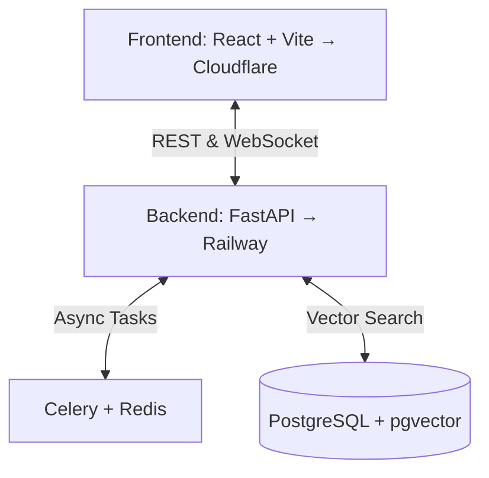

<div align="center">
  
  
  

  <h1>🌌 DevLens AI</h1>

  <p><strong>The Intelligent Cognitive Layer for Software Codebases</strong></p>
  <p>Paste any GitHub repo URL → Get an interactive architecture map, smart Q&A, and auto-generated onboarding docs.<br/>Powered by Claude Sonnet, GPT-4o, and pgvector RAG.</p>
</div>

<br />

## ✨ Features

- 🗺️ **Interactive Architecture Map:** Visualizes files as nodes and import dependencies as directed edges. Experience buttery-smooth, force-directed graph layouts powered by NetworkX.
- 🧠 **Smart Code Q&A:** Ask anything about the codebase in natural language. Powered by LangChain ReAct agents, our AI integration queries semantically chunked code via pgvector.
- 💥 **Blast Radius Analysis:** "What breaks if I change this?" — Determine the precise impact of changes through BFS traversals of the reverse dependency graph.
- 📚 **Auto-Generated Onboarding:** Stop reading outdated wikis. DevLens automatically generates senior-engineer level walkthroughs detailing architecture, conventions, and entry points.
- 📤 **Instant Export:** Export your dependency graphs to Mermaid or PlantUML formats with a single click.

---

## 🛠️ Architecture

A fully decoupled, high-performance architecture built for scale:



### Key Technical Decisions
- **pgvector > ChromaDB:** Consolidated ACID guarantees, seamless SQL joins, and robust relational storage.
- **GitHub Contents API:** Eliminates `git clone` overhead, making public repo ingestion 10x faster.
- **AST-Aware Chunking:** Intelligently splits code based on Python `ast` and JS/TS regex depth parsing.
- **Redis Pub/Sub:** Delivers real-time WebSocket progress streaming for complex ingestion jobs.
- **LangChain ReAct Agent:** Equipped with 4 distinct tools (`search_code`, `read_file`, `query_graph`, `blast_radius`).

---

## 🚀 Quick Start

### Prerequisites
- Docker & Docker Compose
- GitHub OAuth App Credentials
- API Keys: OpenAI & Anthropic

### 1. Clone & Configure
```bash
git clone https://github.com/KaranParmar19/DEVLENS.ai.git
cd DEVLENS.ai
cp backend/.env.example backend/.env
# Edit backend/.env with your API keys
```

### 2. Run the Stack (Docker)
```bash
docker-compose up --build
```
*Your FastAPI backend is now running at `http://localhost:8000` (Swagger docs at `/localhost:8000/docs`).*

### 3. Initialize Database
```bash
docker-compose exec api alembic upgrade head
```

### 4. Start the Frontend
```bash
npm install
npm run dev
```
*Access the high-fidelity dashboard at `http://localhost:5173`.*

---

## 📖 Deep Dive

Want to learn more about the 5-step ingestion pipeline, database schemas, or WebSocket event handling? 

👉 **[Read the Full Documentation](DOCUMENTATION.md)**

---

## 📄 License
This project is licensed under the MIT License.
